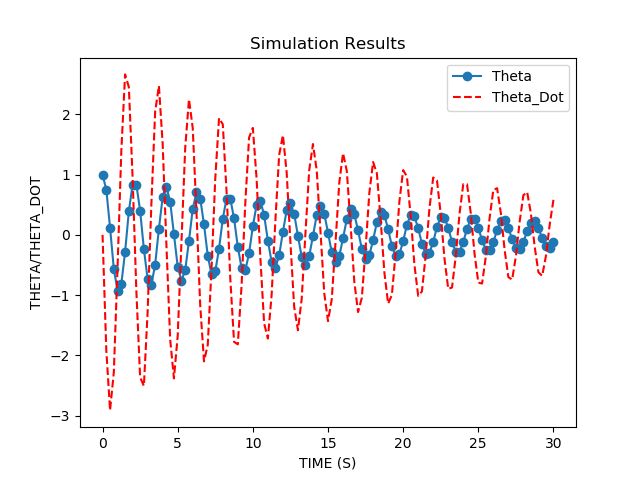

# Drake_Example
This repoitory shows the use of drake library to preform simulation for robotic applications and non linear dynamics

In order to run these examples downlaod the Drake library and create a folder "MAIN"

Then run the examples from the main workspace by running bazel run.

Simulation of the Simple Pendulum (simple_pendulum.cc to run it type : bazel run MAIN:Pendulum)

