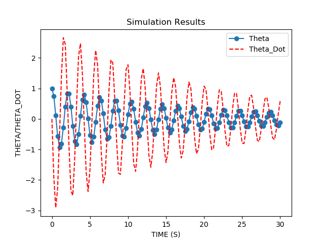
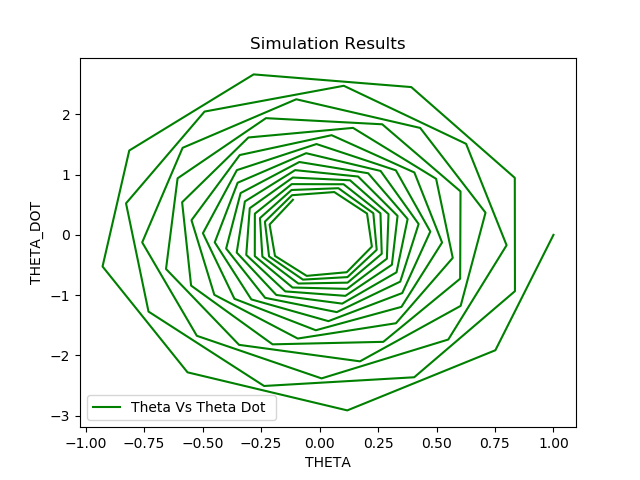
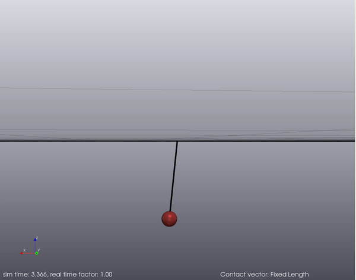

# An Introdution To Drake Library

## Some Tutorials on how to use DRAKE for Beginners

## Cases Covered include : 

### 1- Simulation of a Simple Pendulum :

### 2 - Simulation of Simple Pendulum using Multibody in Drake

